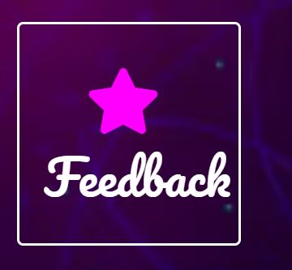
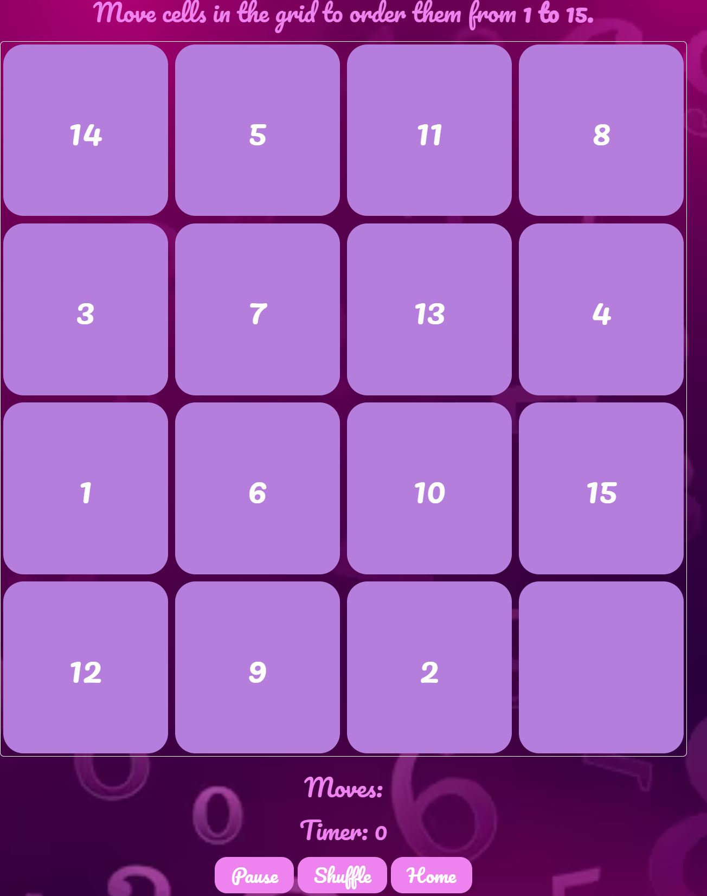
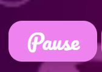
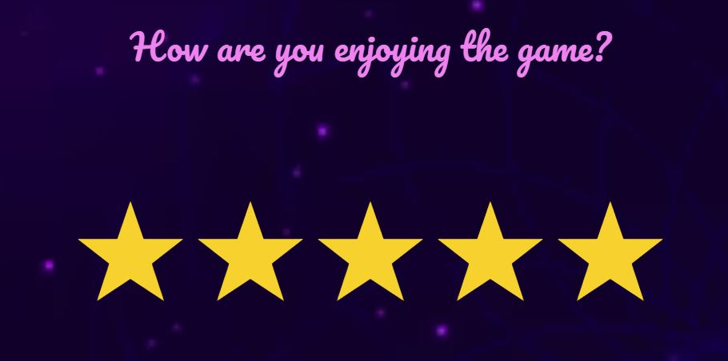
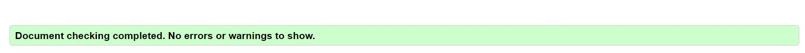
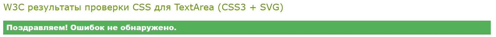
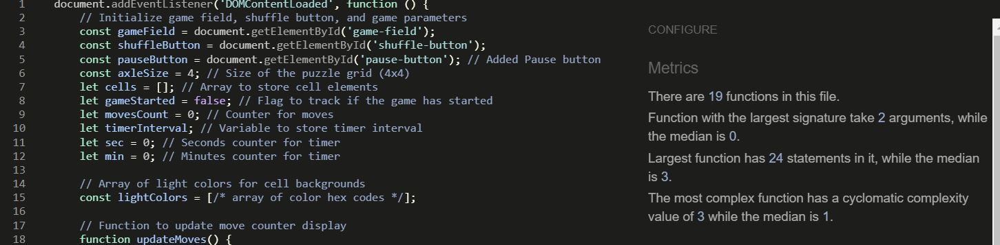
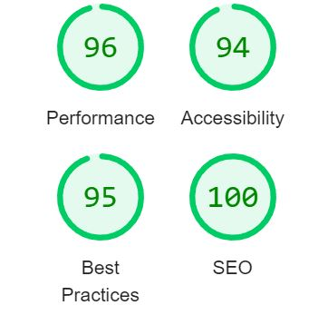

# 15 Puzzle Game

  

## Overview

  

The "15 Puzzle Game" is an engaging web-based puzzle game that challenges players to arrange a grid of tiles in numerical order. This classic brain-teasing game provides hours of entertainment and helps improve your problem-solving skills.

  

## Features and User Benefits

### Existing Features

###  1. User-Friendly Interface

The game offers a user-friendly interface with clear instructions and easy navigation.

User Benefit: 
New and experienced players can quickly understand how to play and start enjoying the game without any hassle.

### 2. Play Button

 The "Play" button allows users to start a new game and dive into the puzzle-solving experience.

User Benefit:
 Players can initiate a game session with a single click, making it convenient and accessible.

### 3. Feedback Form

  The "Feedback" button directs users to a feedback form where they can share their thoughts and experiences with the game.

User Benefit:
 Players can provide feedback, helping improve the game and making it more enjoyable for future users.

  

### 4. Classic Puzzle Challenge

 The 15 Puzzle Game offers a classic and timeless puzzle challenge where players must rearrange the scrambled tiles on a grid to place them in numerical order from 1 to 15.

User Benefits:

- Provides a nostalgic gaming experience for those familiar with the classic puzzle.
- Offers a mental workout to improve problem-solving skills.
- Engages players in a fun and intellectually stimulating activity.

  

### 5. Move Tracking

 The game tracks and displays the number of moves made by the player as they attempt to solve the puzzle.

User Benefits:

- Allows players to challenge themselves to complete the puzzle in as few moves as possible.
- Provides a sense of progress and achievement as players aim to reduce their move count.
- Encourages strategic thinking and planning.

  

### 6. Timer

 The game includes a timer that records the time it takes for the player to solve the puzzle.

User Benefits:

- Adds an element of competition, enabling players to compete with themselves or others for the fastest completion time.
- Creates a sense of urgency and excitement.
- Enhances the replay value as players strive to improve their speed.

### 7. Pause Button

 Players can pause the game at any time using the "Pause" button, allowing them to take a break or resume gameplay later.

User Benefits:

- Offers flexibility and convenience, accommodating players' schedules.
- Reduces stress by enabling players to step away from the game without losing progress.
- Provides control over the gaming experience.

### 8. Shuffle Button

 The "Shuffle" button allows players to start a new game or scramble the puzzle tiles for a fresh challenge.

User Benefits:

- Enables players to reset the puzzle and attempt it again with a different arrangement.
- Adds variety to gameplay and prevents monotony.
- Promotes replayability by offering a different puzzle each time.

### 9. Easy Navigation

 The game provides a "Home" button that allows players to navigate back to the home page effortlessly.

User Benefits:

- treamlines the user experience by offering a clear path to return to the main menu.
- Enhances user-friendliness and ease of use.
- Ensures players can access other parts of the website seamlessly.

### 10. Star Rating System

 Users can rate their experience with the game by selecting a star rating from 1 to 5.

User Benefit: 
This star rating system provides a quick and visual way for players to express their satisfaction level and helps game developers gauge user sentiment.

### 11. Direct Submission

 The feedback form is set up to submit user feedback directly to a specified URL.

User Benefit: 
 Players can easily submit their feedback, knowing that it will be efficiently collected and considered for future improvements

### 12.  Navigation Links

 The feedback form includes navigation links to the "Home" and "Game" pages, allowing users to explore other parts of the website.

User Benefit:
 Players can easily switch between different sections of the website, enhancing their overall browsing experience.

  

### Features Left to Implement

  

I have several enhancements in mind for future releases. Some of them is:

  

-  **Difficulty Levels **  Introduce multiple difficulty levels, such as easy, medium, and hard, by varying the grid size. For example, an easy level could have a 3x3 grid, while a hard level could have a larger 5x5 grid, making the game more challenging.

-  **Hints and Tips ** Include a hint system that provides players with clues or tips on how to solve the puzzle when they get stuck. This feature can help novice players without revealing the entire solution.

-  **Save Game Progress **  Enable players to save their progress in the middle of a game so that they can continue from where they left off in a subsequent session.

-  **Multiplayer Mode **  Implement a multiplayer mode that allows players to compete against each other in real-time, either by solving the same puzzle simultaneously or by racing to complete it first.

These are just a few things that I would like to add to my game,your wishes and suggestions for new features are welcome and appreciated.

  

## Testing

  

### Browser Compatibility

  

15 puzzle web game is designed to be compatible with modern web browsers.

  

- Google Chrome

- AVG Secure Browser

- Microsoft Edge

  

### Responsiveness

  

To ensure a seamless user experience across various devices the project 
was tested and is responsive on different screen sizes including desktops,
 laptops, tablets, and mobile devices.

  

### Manual Functionality Testing

  

Manually tested the functionality of 15 Puzzle web game project
 by interacting with each component and feature. The buttons, links,
  and interactive elements respond appropriately.
   Checked for visual inconsistencies or layout issues.

  

### Validator Testing

  

- HTML

  

- No errors were returned when passing through the official: [HTML Validator](https://validator.w3.org/nu/?doc=https%3A%2F%2Fdevbmv.github.io%2Fgame_RPSLS%2F) 

  

  

- CSS

- No errors were found when passing through the official: [CSS Validator](https://jigsaw.w3.org/css-validator/validator?uri=https%3A%2F%2Fdevbmv.github.io%2Fgame_RPSLS%2F&profile=css3svg&usermedium=all&warning=1&vextwarning=&lang=ru) 

   

  

- JS

- During the development of "15 Puzzle Game" game
 I used the JSHint online tool to ensure the quality and 
 consistency of JavaScript code. Here are some insights and
  actions taken based on the feedback from JSHint:

  

- No errors were returned when passing through the official: [JS Validator](https://jshint.com/) 

 

  

### Metrics Provided by JSHint

- There are **19 functions** in this code.

- The function with the largest signature takes **2 arguments**, while the median number of arguments is **0**.

- The largest function has **24 statements** in it, which indicates a moderate level of complexity and potential areas to refactor for maintainability.

- The most complex function has a value of 3, while the median across the codebase is 1. This suggests a particular function could benefit from simplification to improve readability and ease of maintenance.

  

### Warnings and Fixes:

JSHint has highlighted the use of ES6 syntax and features. 
I have configured JSHint to recognize ES6 by setting 'esversion: 6'.
 This allows to use modern JavaScript features like const, let,
  and template literals, which enhance the code's readability and efficiency.

  

### Lighthouse Audit

  

15 Puzzle Game has been thoroughly tested using Google's Lighthouse audit 
tool to ensure high performance, accessibility, best practices, and search
 engine optimization. The results highlight the efficient design and responsive
  nature of the website, making it a reliable and user-friendly platform.

  

Here are the Lighthouse scores from latest audit:

  

-  **Performance**: 96

-  **Accessibility**: 94

-  **Best Practices**: 95

-  **SEO**: 100

  

  

For a detailed breakdown and to understand more about what each metric means,
 you can view the full Lighthouse report by running the audit yourself in the 
 Chrome browser's developer tools or visit the 
 [Lighthouse website](https://developers.google.com/web/tools/lighthouse).

  
  

## Deployment

  The site was deployed to GitHub pages. The steps to deploy are as follows:

 **Step 1:** Creating New Repository and giving a name (Classic15PuzzleGame) on my GitHub  account.
 Make my repository public.Open a terminal on your computer.

 **Step 2:**  Open vs code on my computer and open new terminal and 
clone the repository using the command:

 "git clone https://github.com/irka775/Classic15PuzzleGame.git".
 

  **Step 3:** Create HTML,CSS and others files and folders necessary for the game into the main local repository directory.

 **Step 4:** Add and Commit changes in the terminal,navigate to the cloned repository directory. Used git add. command to add changes and git commit -m " " to commit changes.

 **Step 5:** Used the comand: git push, to push the changes to GitHub.

 **Step 6:**  Went to my  GitHub repository's page.
Navigate to the "Settings" tab.
Scroll down to the "GitHub Pages" section.
In the "Source" section, selected the main branch.
Click the "Save" button.

**Step 7:**  After few moments,received a link to my game on GitHub pages.

If you do not have a web server, you can simply open the index.html file in your web browser by double-clicking the file or using the open command in the terminal:

Copy code "open index.html"

(This command may vary depending on your operating system; for example, you might use start index.html on Windows or xdg-open index.html on Linux.)

  

## Credits

### Media

The images used in the 15 Puzzle Game  are sourced from the following external website:

  

-  **Source:** [background images numbers](https://www.freepik.com/free-photos-vectors/numbers-background)

 ### Content
  The icons in the footer were taken from : [Font Awesome](https://fontawesome.com/)

## Known Issues

  

During the development and deployment of the 15 puzzle game project,
 the following issues were identified and have been partially addressed. 
However, some issues may still persist on some devices:

  

### Accessibility Concerns:

-  **Contrast Ratios**: Efforts to improve text contrast are underway, enhancing
 readability across the site.

Planned Adjustments: I am in the process of making further
 improvements to enhance readability and user experience.

  

## License

  

This project is released under an open source license.
